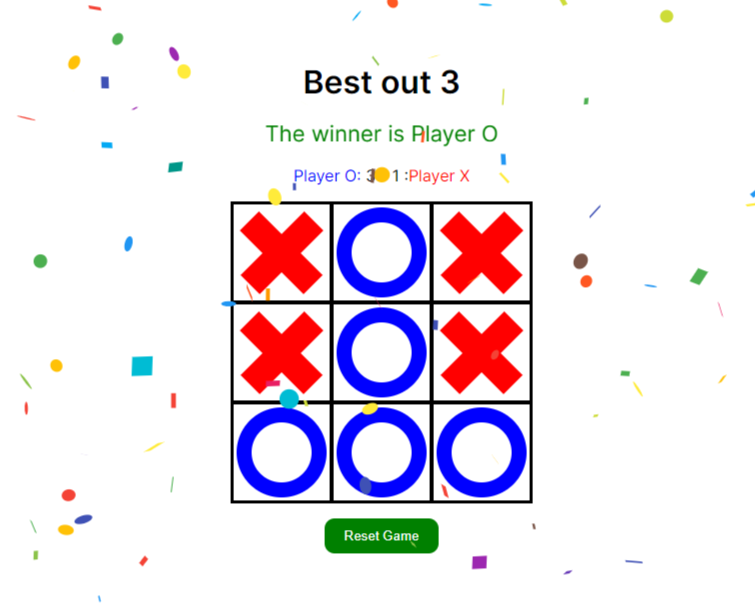

# Tic Tac Toe - In React

Tic Tac Toe is a game played on a 3x3 grid. Players take turns placing a mark in one of the cells of the grid. The goal of the game is for players to position their marks so that they make a continous line of three cells vertically, horizontally, or diagonally.

I built this project following [Ania Kubow's tutorial on YouTube](https://www.youtube.com/watch?v=nrv_O_dIvns) and I also added my own customizations.

## How to run this project

1. Install Node.js and npm (Node Package Manager) on your local machine if you haven't already.

2. Clone this repository and navigate to the root directory of the app project using the `cd` command.

3. Install the dependencies required to run the app by running `npm install` or `yarn` in the command prompt or terminal window. This will download and install all the necessary packages listed in your package.json file.

4. Once the dependencies are installed, you can start the app by running `npm start` or `yarn start` in the command prompt or terminal window. This will start the development server and launch the app in a web browser.

This project was bootstrapped with [Create React App](https://github.com/facebook/create-react-app).

## My customizations
I customized almost everything, but I kept the styling of the gameboard and the marks as [Ania](https://github.com/kubowania) coded them.

- Ania initialized the state that stores the rows of the grid as one array with empty strings. I took a different approach and initialized the state as an array that contains 3 arrays representing rows, and each row had 3 elements (cells) with null.

- I also added a score for each player (Player O and Player X), which updates every time they win a round. The first person to win 3 rounds is considered the winner of the game. The tutorial did not include a score stored for players.

- I display whose turn it is to the player. This was not included in the tutorial.

- When there's a winner, confetti is sprinkled throughout the entire page, and the word displaying the winner is animated with continuous scaling from 0 to 1.5 using the transform property. The user can click the green button to reset the game.

Thank you for cloning this game, feel free to add your own customizations and I hope you enjoy 🤩!!